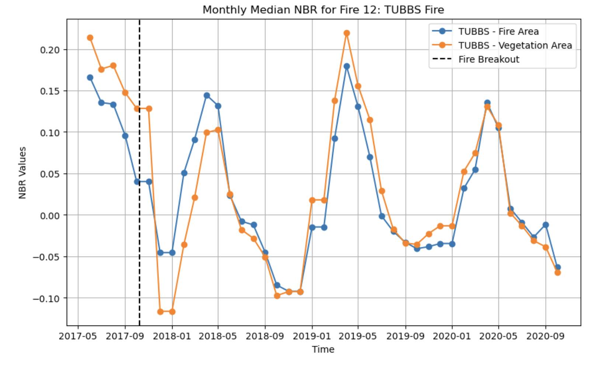

# Eucalyptus And Fire Behavior
## GEOG 313 Advanced Geoanalytic with Python 
### Jason Andrews & Clio Bate

## Project Description

> For this project we used a time series analysis to investigate how a particular species of tree behaves during and after fire events using Landsat Imagery through Microsoft Planetary Computer's API. Research suggests that eucalyptus, a large tree native to Australia, benefits from frequent, intense fires. Fires burn at a higher temperature when they reach eucalyptus stands because the oils in the wood and leaves lead to crown ignition. Moreover, stands of eucalyptus accumulate higher and denser levels of combustible fuels than surrounding vegetation, particularly in coastal California.
Additionally, being a fire adapted tree, research suggests that eucalyptus will resprout more quickly than other vegetation after high intensity burns, giving it an advantage in post fire succession. 

Research Questions:
Does Eucalyptus burn hotter than surrounding vegetation in Northern California?
Does it recover and resprout faster from fires than other vegetation?
Can we show these phenomena with real world data analysis?

## Methodology 
1. The first will produce an NBR comparison plot for each fire
2. second takes an index input and produces a plot for the specified fire
3. The third produces an NBR average for the combined area of all fires and all veg
from 3 months before alarm date until 24 months after¶

## How to use this notebook
> This notebook was developed in Microsofts Planetary Computer Hub and uses its API to collect relevent satelitte imagery
### Environment
> shapely = v2.0.1    
> datetime  
> geopandas = v0.13.2  
> stackstac = v0.5.0 
> dask.array = v2023.5.0  
> pystac_client = v0.7.1  
> leafmap = v0.21.3  
> dask = v2023.5.0  
> planetary_computer = v0.5.1   
> geogif = v0.1.4  
> pandas = v2.0.2
> geojson = v3.0.1  
> json = v2.0.9  
> numpy = v1.24.3  
> xarray = v2023.5.0  
> rioxarray = v0.14.1  
> cartopy.crs  
> pyproj = v3.6.0  
> matplotlib.pyplot  

### Functions
> plot_fire_by_index(index): this function takes an arg "index", the index of the desired fire, and will return the veg vs fire area NBR plot for the specified fire  

### Data Sources

## Credits hamed and aiyin Zhang

### Furtherwork

